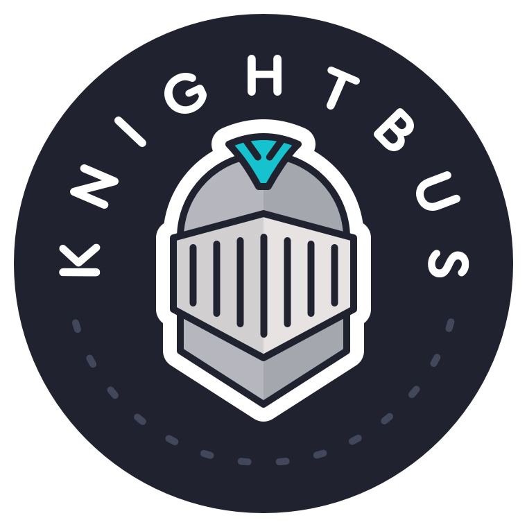

# KnightBus


[](https://www.nuget.org/packages/KnightBus.Core/)
[](https://knightbus.readthedocs.io/en/latest/?badge=latest)

## KnightBus is a fast, lightweight and extensible messaging framework that supports multiple active message transports


[Find the official KnightBus documentation here](https://knightbus.readthedocs.io/)



## Transports
| Package                                                                                                    | NuGet                                                                                                                                                                                 |
|------------------------------------------------------------------------------------------------------------|---------------------------------------------------------------------------------------------------------------------------------------------------------------------------------------|
| [KnightBus.Azure.ServiceBus](https://www.nuget.org/packages/KnightBus.Azure.ServiceBus/)                   | [](https://www.nuget.org/packages/KnightBus.Azure.ServiceBus/)                            |
| [KnightBus.Azure.ServiceBus.Messages](https://www.nuget.org/packages/KnightBus.Azure.ServiceBus.Messages/) | [](https://www.nuget.org/packages/KnightBus.Azure.ServiceBus.Messages/) |
| [KnightBus.Azure.Storage](https://www.nuget.org/packages/KnightBus.Azure.Storage/)                         | [](https://www.nuget.org/packages/KnightBus.Azure.Storage/)                                     |
| [KnightBus.Azure.Storage.Messages](https://www.nuget.org/packages/KnightBus.Azure.Storage.Messages/)       | [](https://www.nuget.org/packages/KnightBus.Azure.Storage.Messages/)          |
| [KnightBus.Redis](https://www.nuget.org/packages/KnightBus.Redis/)                                         | [](https://www.nuget.org/packages/KnightBus.Redis/)                                                             |
| [KnightBus.Redis.Messages](https://www.nuget.org/packages/KnightBus.Redis.Messages/)                       | [](https://www.nuget.org/packages/KnightBus.Redis.Messages/)                                  |
| [KnightBus.Nats](https://www.nuget.org/packages/KnightBus.Nats/)                                           | [](https://www.nuget.org/packages/KnightBus.Nats/)                                                                |
| [KnightBus.Nats.Messages](https://www.nuget.org/packages/KnightBus.Nats.Messages/)                         | [](https://www.nuget.org/packages/KnightBus.Nats.Messages/)                                     |

## Monitoring
| Package                                                                                                    | NuGet                                                                                                                                                                                 |
|------------------------------------------------------------------------------------------------------------|---------------------------------------------------------------------------------------------------------------------------------------------------------------------------------------|
| [KnightBus.ApplicationInsights](https://www.nuget.org/packages/KnightBus.ApplicationInsights/)             | [](https://www.nuget.org/packages/KnightBus.ApplicationInsights/)                   |
| [KnightBus.NewRelic](https://www.nuget.org/packages/KnightBus.NewRelic/)                                   | [](https://www.nuget.org/packages/KnightBus.NewRelic/)                                                    |

## Serialization
| Package                                                                                                    | NuGet                                                                                                                                                                                 |
|------------------------------------------------------------------------------------------------------------|---------------------------------------------------------------------------------------------------------------------------------------------------------------------------------------|
| [KnightBus.ProtobufNet](https://www.nuget.org/packages/KnightBus.ProtobufNet/)                             | [](https://www.nuget.org/packages/KnightBus.ProtobufNet/)                                           |
| [KnightBus.Newtonsoft](https://www.nuget.org/packages/KnightBus.Newtonsoft/)                               | [](https://www.nuget.org/packages/KnightBus.Newtonsoft/)                                              |
| [KnightBus.MessagePack](https://www.nuget.org/packages/KnightBus.MessagePack/)                             | [](https://www.nuget.org/packages/KnightBus.MessagePack/)                                           |

## Framework
| Package                                                                                                    | NuGet                                                                                                                                                                                 |
|------------------------------------------------------------------------------------------------------------|---------------------------------------------------------------------------------------------------------------------------------------------------------------------------------------|
| [KnightBus.Host](https://www.nuget.org/packages/KnightBus.Host/)                                           | [](https://www.nuget.org/packages/KnightBus.Host/)                                                                |
| [KnightBus.Core](https://www.nuget.org/packages/KnightBus.Core/)                                           | [](https://www.nuget.org/packages/KnightBus.Core/)                                                                |
| [KnightBus.Messages](https://www.nuget.org/packages/KnightBus.Messages/)                                   | [](https://www.nuget.org/packages/KnightBus.Messages/)                                                    |
| [KnightBus.SqlServer](https://www.nuget.org/packages/KnightBus.SqlServer/)                                 | [](https://www.nuget.org/packages/KnightBus.SqlServer/)                                                 |
| [KnightBus.Schedule](https://www.nuget.org/packages/KnightBus.Schedule/)                                   | [](https://www.nuget.org/packages/KnightBus.Schedule/)                                                    |

## Message Processing
```csharp
public class CommandProcessor : IProcessCommand<SampleCommand, SampleSettings>,
{
    public CommandProcessor(ISomeDependency dependency)
    {
        //You can use your own container for dependency injection
    }

    public Task ProcessAsync(SampleCommand message, CancellationToken cancellationToken)
    {
        //Your code goes here
        return Task.CompletedTask;
    }
}
```

## Initialization
```csharp
class Program
{
    static async Task Main(string[] args)
    {
            var host = Microsoft.Extensions.Hosting.Host.CreateDefaultBuilder(args)
            .ConfigureServices(services =>
            {
                //Multiple active transports
                services.UseServiceBus(config => config.ConnectionString = "sb-connection")
                        .UseTransport<ServiceBusTransport>()
                        .UseBlobStorage(config => config.ConnectionString = "storage-connection")
                        .UseTransport<StorageTransport>()
                        .RegisterProcessors();
            })
            .UseKnightBus().Build();                

            await host.StartAsync(CancellationToken.None);
    }
}
```

## Bring your own Middleware

KnightBus supports inserting your own middleware into the execution pipeline.

```csharp
public class CustomThrottlingMiddleware : IMessageProcessorMiddleware
    {
        private readonly SemaphoreQueue _semaphoreQueue;
        public int CurrentCount => _semaphoreQueue.CurrentCount;

        public CustomThrottlingMiddleware(int maxConcurrent)
        {
            _semaphoreQueue = new SemaphoreQueue(maxConcurrent);
        }
        public async Task ProcessAsync<T>(IMessageStateHandler<T> messageStateHandler, IPipelineInformation pipelineInformation, IMessageProcessor next, CancellationToken cancellationToken) where T : class, IMessage
        {
            try
            {
                await _semaphoreQueue.WaitAsync().ConfigureAwait(false);
                await next.ProcessAsync(messageStateHandler, cancellationToken).ConfigureAwait(false);
            }
            finally
            {
                _semaphoreQueue.Release();
            }
        }
    }
```

## Write your own Plugin

KnightBus supports custom plugins. Examples of existing plugins are: TcpAliveListener (K8S liveness probes) and Scheduling (Chron triggers). 

```csharp
public class CustomPlugin : IPlugin
{
    public CustomPlugin(ISomeDependency dependency, ILogger<CustomPlugin> logger)
    {        
    }

    public async Task StartAsync(CancellationToken cancellationToken)
    {
        // Start the plugin
    }
}
```

## Documentation

To get documentation up and running locally, do the following.

1. Install `sphinx`: https://www.sphinx-doc.org
2. Install `sphinx_rtd_theme`: https://github.com/readthedocs/sphinx_rtd_theme
3. Run `make html source build` in the documentation folder
4. Open `documentation/build/html/index.html` in a browser to preview your changes

For Linux:

```console
# In documentation folder:

$ sudo apt install python3 python3-sphinx python3-pip
$ python3 -m pip install sphinx-rtd-theme
$ make html source build
$ sensible-browser build/html/index.html
```
